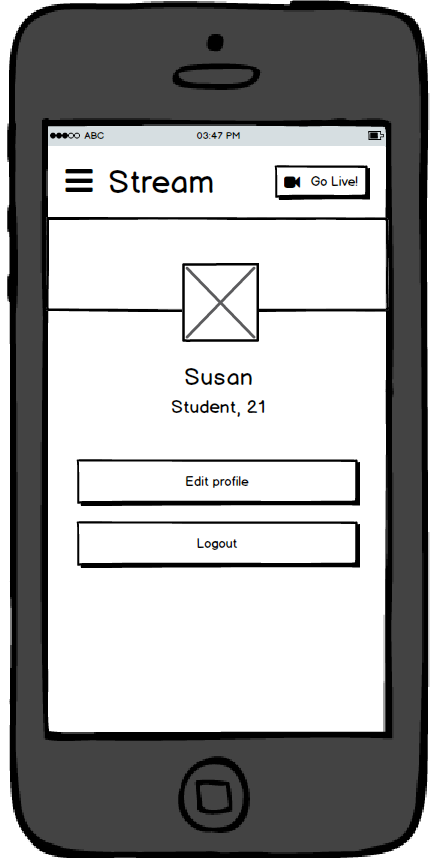
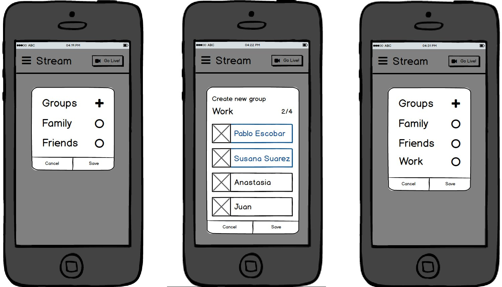
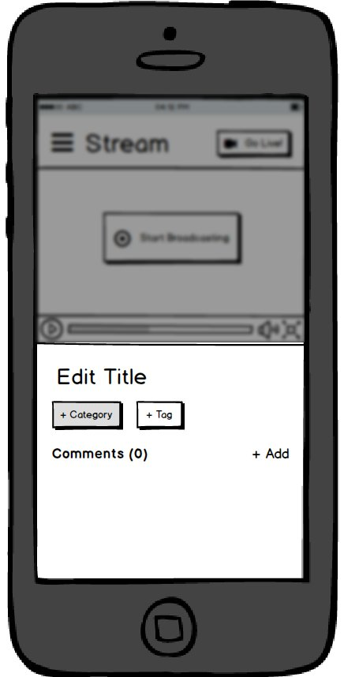
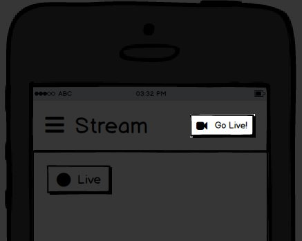
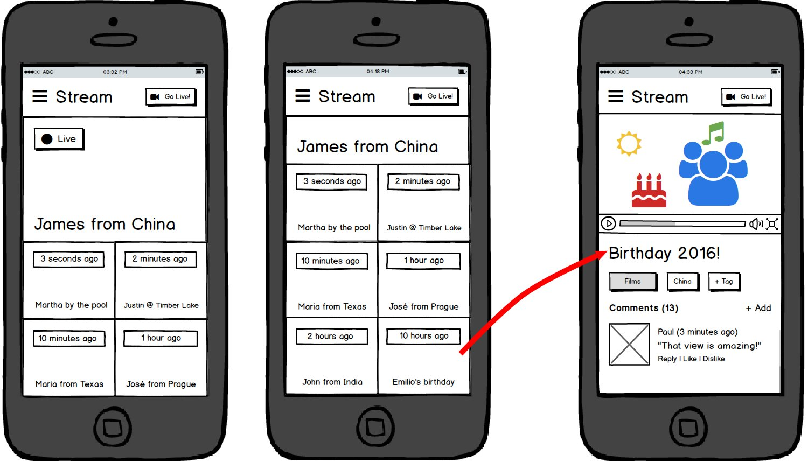
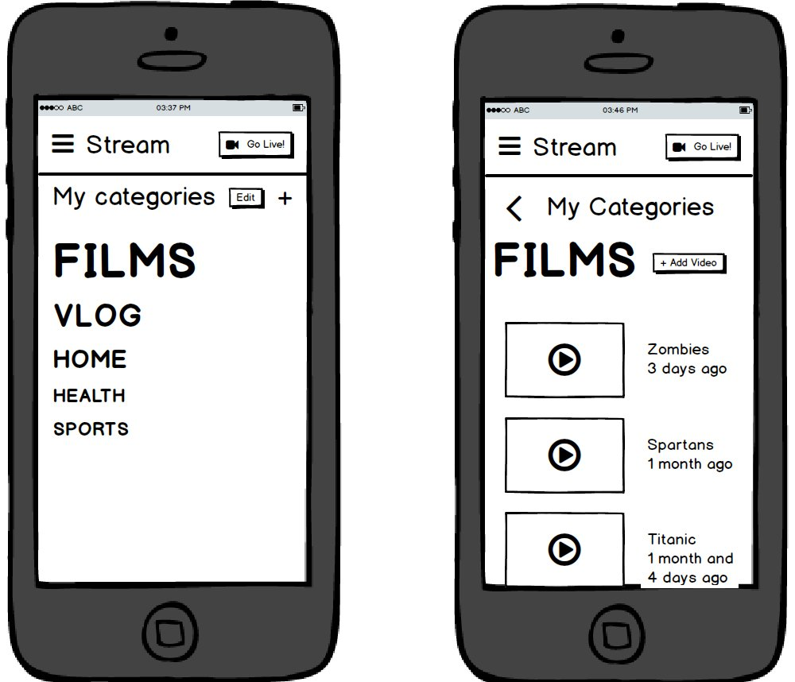
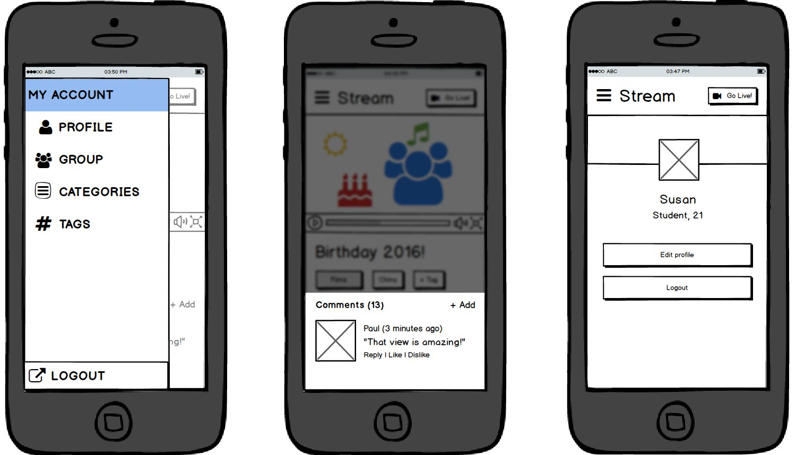

## Introduction

_Stream_ is a real-time broadcasting app, targeted for mobile devices on the web. It allows the user to record live streams and share them with the people they care about. In addition, we allow the users to classify their past broadcast into categories and tags. We focused on giving total control over the groups (family, friends, work...) the broadcast is shared with. We aimed to make it really easy to start a stream for any target group or groups:

## Changes from the previous version

There were some minor changes in functionality and design with respect to the previous assignment. Firstly, added a profile page, so that the user can see his or her personal data and edit it. Secondly, we improved the representation of the group popup, adding the additional steps that were assumed and missing in the video. Lastly, we added some additional steps to the video page as well, to represent the empty fields and how they get filled.

## Innovative interface elements

The main innovation this application presents is the ability to easily broadcast to any group of people the user knows from anywhere in the app with the push of a button:

In addition to that, we created a clean view of the broadcasts that other people have shared with the user orderded by date.

Our last major innovation is the categories system, which provides the users with an easy and intuitive way of managing their past broadcasts.

Other elements we incorporate from the application ecosystem are the burger menu to access different parts of the app, the comment system in the video page, and a simple profile page.

