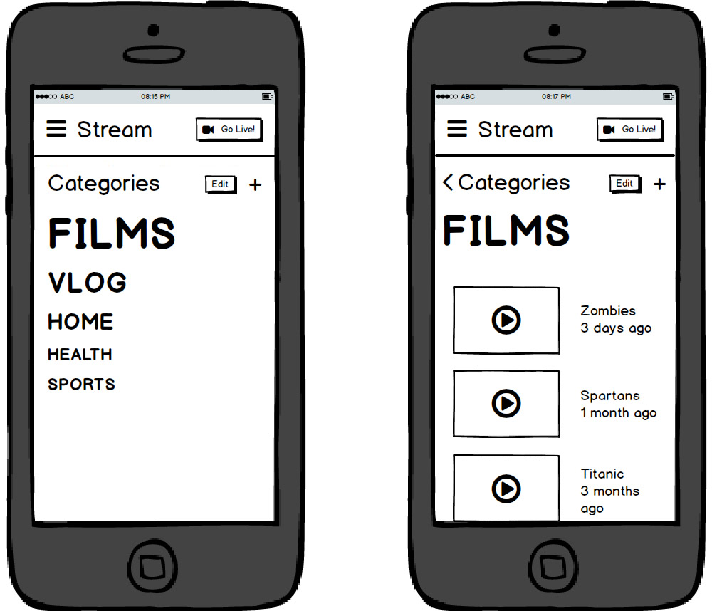

## Introduction

_Stream_ is a real-time broadcasting app, targeted for mobile devices.

It allows users to record live streams and share them with the people they care about.

In addition, Stream allows users to classify their past broadcast into categories and tags.

We focused on giving total control over the groups you share the broadcasts with (family, friends, work...). So its really easy to start a stream for any group(s).

## Changes from the previous version

There are some minor changes in functionality and design with respect to the previous assignment. Firstly, we added a profile page, so that the users can see and edit their personal data.

{width=50% height=50%}

Secondly, We improved the representation of the group popup, adding  additional steps that We omitted (intentionally) from the video.

{width=50% height=50%}

Lastly, we added some additional steps to the video page as well. Now there are different views to fill the title, tag or categories.

{height=50%}

\pagebreak

## Innovative interface elements

The main innovation this application presents is the ability to easily broadcast video privately to any important group of your life. You can start streaming from anywhere in the app with the press of a button:

{width=70% height=40%}

In addition to that, we created a clean view of the broadcasts, ordered by date, that other friends have shared with you.

{height=50%}

\pagebreak

Our last major innovation is the categories system, which provides the users an easy and intuitive way of managing their past broadcasts.

{height=50%}

Other elements We incorporate, respecting the ecosystem, is the burger menu to access different parts of the app, the comment system in the video page and the simple profile page.

{height=50%}
